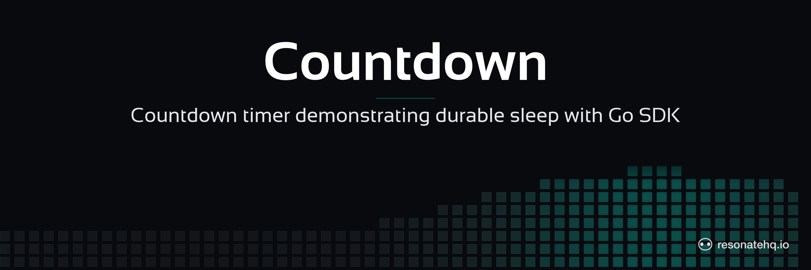

<p align="center">
  <picture>
    <source media="(prefers-color-scheme: dark)" srcset="./assets/banner-dark.png">
    <source media="(prefers-color-scheme: light)" srcset="./assets/banner-light.png">
    
  </picture>
</p>

<p align="center">
  <a href="https://resonatehq.github.io/examples-ci/">
    
  </a>
</p>

# Countdown | Resonate Go SDK

A durable countdown: tick from N to 1, posting a notification on each tick and sleeping between ticks. If the worker crashes mid-countdown, restarting picks up at the next pending tick rather than starting over.

> Heads up — `resonate-sdk-go` is pre-release. The SDK has no semver tag yet, so this example pins to a specific commit. Expect API changes until `v0.1.0`.

## What this demonstrates

- `ctx.Sleep(d)` for durable timers — the workflow suspends until the timer elapses, and a worker restart resumes from the right tick.
- `ctx.RPC("notify", ...)` for durable side-effects — each notification is a promise on the server, so a crashed worker doesn't drop the in-flight HTTP call.
- A simple orchestrator function calling a child function in a loop.

## The code

```go
func countdown(ctx *resonate.Context, args CountdownArgs) (CountdownResult, error) {
    sent := 0
    for i := args.Start; i > 0; i-- {
        f, _ := ctx.RPC("notify", NotifyArgs{Count: i, URL: args.NotifyURL})
        var r NotifyResult
        if err := f.Await(&r); err != nil {
            return CountdownResult{}, fmt.Errorf("notify %d: %w", i, err)
        }
        sent++

        if i > 1 {
            s, _ := ctx.Sleep(time.Duration(args.StepSeconds) * time.Second)
            if err := s.Await(nil); err != nil {
                return CountdownResult{}, err
            }
        }
    }
    return CountdownResult{Sent: sent}, nil
}
```

The `if i > 1` guard skips the trailing sleep after the last notify — the workflow doesn't pause after the final tick.

## Prerequisites

- Go 1.22+
- The `resonate` server CLI. Install with Homebrew on macOS or Linux:
  ```
  brew install resonatehq/tap/resonate
  ```
  Other install paths: <https://docs.resonatehq.io/get-started/quickstart>.

## Setup

```sh
git clone https://github.com/resonatehq-examples/example-countdown-go.git
cd example-countdown-go
go mod download
```

## Run it

In one terminal, start the dev server:

```sh
resonate dev
```

In another, run the example:

```sh
# offline (prints to stdout each tick)
go run .

# with a real URL — ntfy.sh is a good ad-hoc notification target
go run . -start=5 -step=2 -url=https://ntfy.sh/your-topic
```

Flags:

| Flag    | Default | Meaning                                  |
|---------|---------|------------------------------------------|
| `-start`| `3`     | starting count                           |
| `-step` | `1`     | seconds to sleep between ticks           |
| `-url`  | `""`    | URL to POST each tick to (empty = skip)  |

## What to look for

With `-start=3 -step=1 -url=""`:

```
[countdown] starting workflow id=countdown-... start=3 step=1s url=""
  [notify] 3 (no URL — skipping HTTP)
  [notify] 2 (no URL — skipping HTTP)
  [notify] 1 (no URL — skipping HTTP)
[countdown] done; sent 3 notifications
```

With a real URL, you'll see `[notify] N -> https://... 200 OK` lines and corresponding posts at the destination.

On the Resonate dashboard at <http://localhost:8001> you'll see one workflow promise plus N child promises for `notify` and N-1 for `sleep`.

## File structure

```
example-countdown-go/
├── main.go        countdown orchestrator + notify child + main
├── go.mod         module declaration + SDK pin
├── go.sum         checksums
├── assets/        README banner images
├── LICENSE        Apache-2.0
└── README.md
```

## Next steps

- [Durable sleep](https://docs.resonatehq.io/learn/durable-promises) — what `ctx.Sleep` is doing under the hood.
- [Get started](https://docs.resonatehq.io/get-started) — install paths + first-program walkthrough.
- [`example-fan-out-fan-in-go`](https://github.com/resonatehq-examples/example-fan-out-fan-in-go) — parallel dispatch instead of sequential ticks.
- **Coming from Temporal?** See [MIGRATING-FROM-TEMPORAL.md](MIGRATING-FROM-TEMPORAL.md) — a side-by-side port of the matching `temporalio/samples-go` example.

## Community

- Discord: <https://resonatehq.io/discord>
- X: <https://x.com/resonatehqio>
- LinkedIn: <https://linkedin.com/company/resonatehq>
- YouTube: <https://youtube.com/@resonatehq>
- Journal: <https://journal.resonatehq.io>

## License

[Apache-2.0](./LICENSE)
